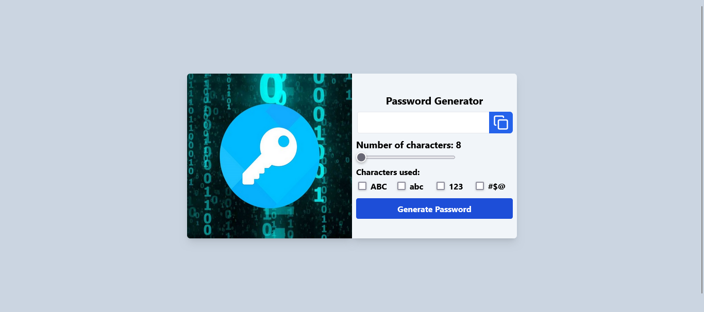

# Password Generator
Uma aplicação que permite gerar senhas seguras com a possibilidade de incluir letras maiúsculas, minúsculas, números e caracteres especiais, de acordo com as preferências do usuário.

This project was bootstrapped with [Create React App](https://github.com/facebook/create-react-app).

## 🔥 Introdução
* Gerar uma senha de até 16 caracteres.

* Permitir selecionar quais tipos de caracteres devem ser incluídos na senha (letras maiúsculas, minúsculas, números e caracteres especiais).

### 🔨 Guia de instalação
Instalação:

    1.Clone o repositório.

    2.Execute npm install para instalar as dependências.

Passo a Passo para Rodar:

    Execute npm start para iniciar o servidor de desenvolvimento.
    
    Acesse http://localhost:3000 no navegador para utilizar a aplicação.

## 📦 Tecnologias usadas:
 
 

## 👷 Autores

* **Ingrid Souza** - *Front-End* - [GitHub](https://github.com/IngridsSilveira)